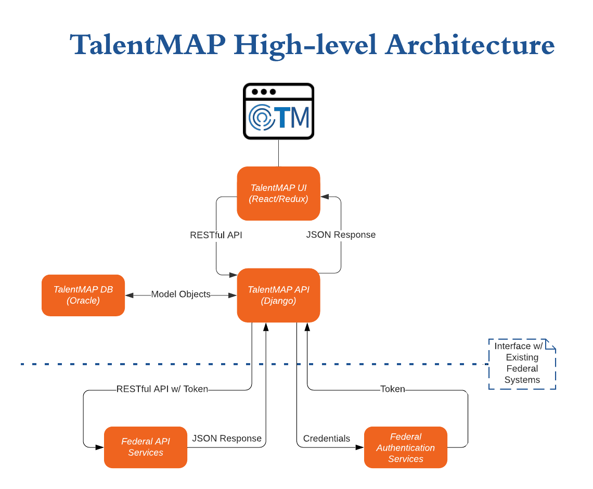

# United States Department of State TalentMAP

## Overview

A comprehensive research, bidding, and matching system that pairs Foreign Service employees to available positions. Key features include:
#### Researching
- Searching and Filtering Positions
- Saving Searches
- Favoriting Positions
- Comparing Positions
#### Bidding
- Submitting & Updating Bids (Job Applications)
- Monitoring Bid Status
#### Matching (Currently Under Development)
- Candidate Ranking
- Ability to Progress Candidate Bid (Accept or Reject)
#### Position Management (Future Development)
- Ability to Manage Positions for Bidding (Create, Edit, Delete)

## Architecture
The system can be divided into 3 parts:
1) Frontend UI (this repository)
2) [Backend API](https://github.com/MetaPhase-Consulting/State-TalentMAP-API)
3) Existing Federal Services

The frontend is responsible for providing a clean user experience leveraging React and Redux, while the data is supplied by the Django MVT framework. The system is meant to operate independently or with existing federal data APIs, allowing the system to remain flexible with new or legacy application data. This empowers developers by allowing them to expand new features with the TalentMAP application while leveraging existing data services already provided to other federal applications.

## Getting Started

### Dependencies

We use `yarn` as our package manager, available for [download here](https://yarnpkg.com/).  Where possible, we've included the corresponding commands for `npm`.

Install dependencies with `yarn install` or `npm i`

### EditorConfig

We use [EditorConfig](http://editorconfig.org/) to ensure consistency across file formats and code editing environments.  EditorConfig supports a variety of popular code editors listed [here](http://editorconfig.org/#download).

## Running the App

### TalentMAP API

You will need the [State TalentMAP API](https://github.com/USStateDept/State-TalentMAP-API) running locally in order for this application to make requests to the API.

### React Application

#### `yarn start` or `npm start`

Runs the app in development mode.  Open [http://localhost:3000](http://localhost:3000) to view it in the browser.

The page will reload if you make edits.  You will see the build errors and lint warnings in the console.

#### `yarn test` or `npm test`

Runs the test watcher in an interactive mode. 
By default, runs tests related to files changed since the last commit.

[Read more about testing.](https://github.com/facebookincubator/create-react-app/blob/master/packages/react-scripts/template/README.md#running-tests)

#### `yarn build` or `npm run build`

Builds the app for production to the `build` folder.  It correctly bundles React in production mode and optimizes the build for the best performance.

The build is minified and the filenames include the hashes.  By default, it also [includes a service worker](https://github.com/facebookincubator/create-react-app/blob/master/packages/react-scripts/template/README.md#making-a-progressive-web-app) so that your app loads from local cache on future visits.

Your app is ready to be deployed.

See the [create-react-app](https://github.com/facebookincubator/create-react-app) documentation for more details.

## Docker

The front end application is Dockerized and available in a `docker-compose` stack with the API.  Setup and more available [here](DOCKER.md).

## Deploying

There is a brief deployment guide [here](deploy/DEPLOY.md) that discusses deployment up the front end application.  For more thorough intructions, including the API, checkout out the [wiki](https://github.com/USStateDept/State-TalentMAP/wiki/Deployment-Guide).

## Accessibility

Accessibility tests can be run in a CI environment using `pa11y-ci`. By default, it tests the URL array found in `.pa11yci` using the WCAG 2.0 AA standard. Be sure to update the array of URLs with IDs that exist in your environment's database.

[USWDS Documentation](https://v1.designsystem.digital.gov/components/) 

## Contributing

See [CONTRIBUTING](CONTRIBUTING.md) for additional information.

## Public domain

This project is in the worldwide [public domain](LICENSE.md). As stated in [CONTRIBUTING](CONTRIBUTING.md):

> This project is in the public domain within the United States, and copyright and related rights in the work worldwide are waived through the [CC0 1.0 Universal public domain dedication](https://creativecommons.org/publicdomain/zero/1.0/).
>
> All contributions to this project will be released under the CC0 dedication. By submitting a pull request, you are agreeing to comply with this waiver of copyright interest.
